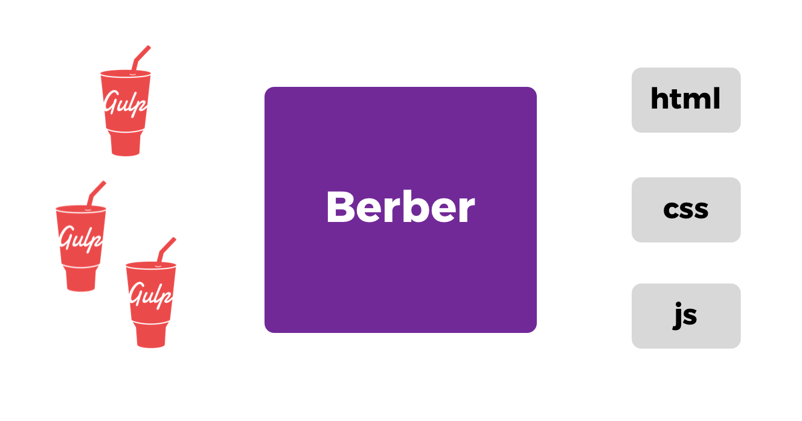
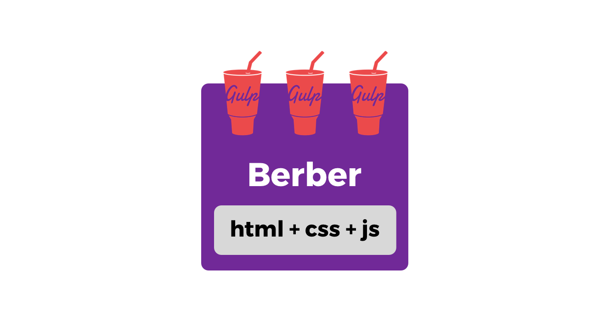
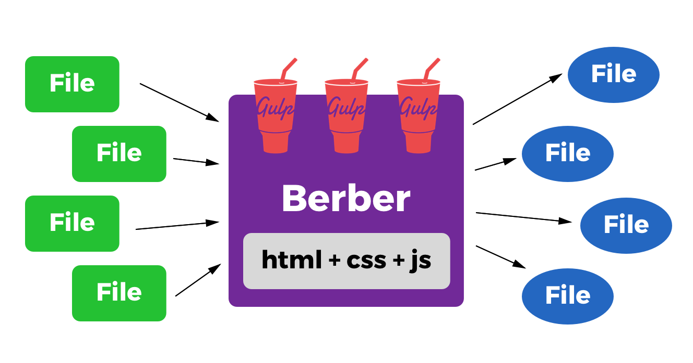
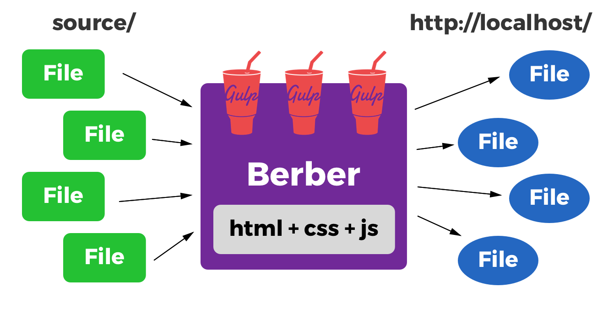

class: middle, center, inverse
# Berber の話

## 日野澤歓也 @kt3k

---
# @kt3k

- twitter.com/kt3k
- github.com/kt3k

---
class: middle, center
# JavaScript の<br />静的サイトライブラリ<br />Berber のご紹介
---
class: middle, center
# Berber を一言で言うと
---
class: middle, center
## 静的サイトジェネレータジェネレータ
---
class: middle, center, inverse
# それは何?
### を説明していきます
---
# Agenda
- **Static Site Generator** とは
- **Berber** の紹介
- **Berber** 応用編

---
class: middle, center
## 第一部
# SSG = Static Site Generator
## 静的サイトジェネレータとは

---
# Static Site Generator
- **静的 Web Site を生成**するツール
- 通常はコマンドラインツール
- 典型的な静的サイトジェネレータは
  - **マークダウンファイルを入力**として
  - **静的 Web Site 一式**を出力する

---
# Static Site Generator の例
- **[middleman][]**
- **jekyll**
- **hugo**
- **gatsby**
- ...

---
# 主な Static Site Generator の用途
- ブログ
- コーポレートサイト
- プロモーションサイト

**更新頻度が高く無い**サイトによく使われる

---
class: middle, center, inverse
# ところで

---
class: middle, center, inverse
middleman, jekyll, hugo などは**汎用**<br />の静的サイトジェネレータ

---
class: middle, center, inverse
汎用 = **どんなサイトでも**生成できる

---
class: middle, center, inverse
# 逆にいうと

---
class: middle, center, inverse
特殊なサイトを作ろうと思ったら**設定/ルール/htmlなどをたくさん**書かなければいけない

---
class: middle, center, inverse
特殊なサイトをより簡単に生成できるタイプの静的サイトジェネレータがある 💡

---
# 目的特化型 SSG
- **GitBook**
  - **本**の静的サイトジェネレータ
- **Slate**
  - **API ドキュメント**の SSG
- **Storybook**
  - **UI コンポーネント見本**の SSG


---
class: middle, center, inverse
**もっと特殊**なサイトを生成したかったらどうするか

---
# 特殊なサイト生成がしたい例
- **社内でよく使われている** **データ形式**をいい感じに静的サイト化したい
- **社内ルール** で書かれた **md ドキュメント**をいい感じに静的サイト化したい
- **個人的に** よく使う**データ形式**を Web Page 化したい

---
class: middle, center, inverse
あまりにも特殊な要件ごとに静的サイトジェネレータを作っていたら工数がいくらあっても足りない・・・

---
class: middle, center, inverse
静的サイトジェネレータを**超簡単**に作れるツールがあれば・・・

---
class: middle, center, inverse
# そのためのツールが、・・・

---
class: middle, center, inverse
# Berber

---
class: middle, center
# 第二部

# Berber の紹介

---
# Berber 概要

- **gulp-plugin** のリストを受け取って
- **Static Site Generator** を返す

---
# Berber 概要

- **gulp-plugin** のリストを受け取って
- **Static Site Generator** を返す

-> **Static Site Generator Generator**

---
class: center
# 材料



---
class: center
# MySSG



---
class: center
# MySSG build



---
# Berber 概要
- 変換ルールに基づいてファイルの watch・serve も Berber が行う

---
class: center
# MySSG serve



---
# Berber 概要
- gulp プラグインの組み合わせで欲しい SSG の**変換**を表現する
- 現在 **3000+** 以上の gulp プラグインが[レジストリ](https://gulpjs.com/plugins/) に登録されていて、ありがちな変換はほぼプラグインの組み合わせで実現可能

---
# Berber 概要
- 変換過程で例えば **gulp-wrap** のような変換をかければ、データを任意の html 表現の中に落とし込むことが可能

---
class: middle, center, inverse
# つまり
---
class: middle, center, inverse
# gulpfile を書く労力 と<br/>Web Site 作成の労力 で<br/>SSG が作れる!

---
# 具体的な使い方

```
$ npm i --save berber
```

---
# 具体的な使い方 2

my-ssg.js
```
const berber = require('berber')

berber.name('ツールの名前')

berber.asset('globパターン')
  .pipe(gulpプラグイン1())
  .pipe(gulpプラグイン2())
  ...
```

- 詳細は [API ドキュメント][berber] 参照

---
# Berber 使い方

package.json

```
{
  "name": "ツールの名前",
  "bin": "./my-ssg.js"
}
```

以上を設定して、コマンドラインで

```
$ npm publish
```

---
# Berber 使い方

以上で my-ssg が npm に publish された状態

```
$ npm i -g my-ssg
```

```
$ my-ssg -h # ヘルプ表示
$ my-ssg serve # 開発サーバー起動
$ my-ssg build # 静的サイト生成
```

---
class: middle, center, inverse
# 第三部

# Berber 応用編

---
class: middle, center, inverse
具体的な Berber の利用例

---
## 課題1: ドメインモデルのドキュメント

- **ドメイン駆動開発**を行う際に**ドメインモデル**をきちんとドキュメントしていくことが大事
- 既存ツールでもある程度ドキュメントできるが、**[いまいちしっくりこない](https://qiita.com/kt3k/items/5f38267a65ef0e47a5d3)**
  - -> **専用ドキュメントツール**欲しい

---
## 解決1: domaindoc

- **[ドメインモデルの md](https://github.com/kt3k/moneybit/tree/master/packages/moneybit-domain) **から**[モデル一覧サイト](https://kt3k.github.io/moneybit-app/domaindoc/)**を生成する専用 SSG
- **6 gulp plugins** を使用: gulp-marked, gulp-front-matter, layout1 etc
- **必要最小限**の入力で、**詳細な見せ方**と**一覧的な見せ方**の両方ができる

---
## 課題2: 翻訳抜け漏れチェック

- **JSON 形式の翻訳データ**を複数のプロダクトで使いまわしているが、多言語まとめて**一覧表示する方法がない**ため、**抜け漏れや不整合**の確認が非常に**煩雑**

---
## 解決2: langsheet

- JSON ソースを**一覧表**にする SSG
- **2 gulp plugins** を使用: vinyl-accumulate, layout1
- 例: [JSON ソース](https://github.com/kt3k/moneybit-app/tree/master/src/i18n) / [サイト](https://kt3k.github.io/moneybit-app/langsheet/)

---
## 課題3: スライドを md で書きたい
- スライドを **md** で書きたい
- **docset** というツールでできる
  - **有料なので NG**
- **Qiita スライドモード**でできる
  - **表示の調整が弱い**
  - プロジェクターの**解像度が低い**と発表が成り立たないリスクあり -> **NG**

---
## 課題3: マークダウンでスライドを作る
- **remark.js** というのがあって、html の中に書いた md をスライドにしてくれる.
- ただし、html の中に、**マークアップ** / **js** / **css** を手で書かないといけない
  - **かなり惜しい**
- md だけを書いてスライドにしたい

---
## 解決3: remarker

- **md ファイル**から**remark.js 設定済み html**を生成する SSG
- **2 gulp plugins** を使用: gulp-rename, layout1
- **このスライドは remarker で出来ています**

---
# Berber が解決する問題まとめ

- **いい感じにドキュメント**したい
  - (domaindoc)
- **ファイル / データを見える化**したい
  - (langsheet)
- **煩雑な記述**を**ミニマル化**したい
  - (remarker)

---
## 今後 Berber が使えそうと思う領域

- **ゲーム制作用データ**のビジュアライズ
  - ゲーム制作は**特殊なデータ**だらけ
  - **エディタ制作**に多大な工数がしばしば必要になる
  - 入力をテキストデータにすれば **SSG をエディタ代わり**にできる

---
## 今後 Berber が使えそうと思う領域
- **ソースコードメタ情報の可視化**
  - **gulp-babylon** で AST にしてから興味のある情報だけを抜き出す
  - 例えば、**TODO コメントを一覧化**して残タスクが可視化されるツールとか

---
class: middle, center, inverse
# Visualize your data 🔍
# &nbsp;
# &nbsp;
---
class: middle, center, inverse
# Visualize your data 🔍
# Accelerate your workflow 🏃
# &nbsp;
---
class: middle, center, inverse
# Visualize your data 🔍
# Accelerate your workflow 🏃
# With Berber
---
class: middle, center, inverse
### Berber を使ってくれる人を募集中!
---
class: middle, center, inverse
### お問い合わせは twitter.com/kt3k まで

---
class: middle, center
## ご静聴ありがとうございました 🙇

[middleman]: https://middlemanapp.com/
[berber]: https://github.com/kt3k/berber
